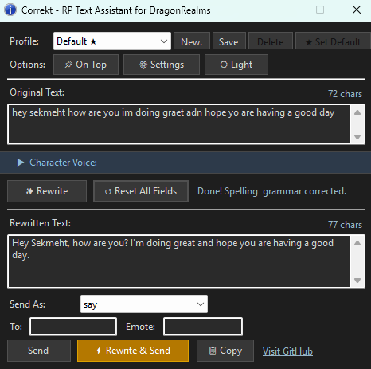
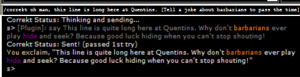
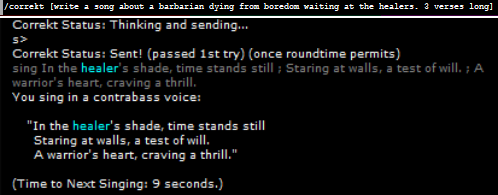

# Correkt — RP Text Assistant for DragonRealms

| | |
|---|---|
| **Version** | v1.2b |
| **Author** | Sekmeht Usho |
| **Release** | Coming Soon |

Correkt helps DragonRealms players write immersive, in-character roleplay using AI, so anyone can find their voice in Elanthia regardless of writing ability.

<kbd></kbd>
<kbd></kbd>
<kbd></kbd>
<kbd></kbd>

*(The name is a blend of "Correct" and "Wrecked" — because sometimes your text is both at the same time.)*

---

## Why It Exists

DragonRealms runs on written communication. How your character speaks shapes how others experience you, and for many players that pressure is real. Dyslexia, language barriers, anxiety, or simply not having grown up reading fantasy fiction can make roleplay feel out of reach.

Correkt is built to change that. It takes what you mean to say and helps you say it in a way that feels natural in Elanthia, without changing your voice, your intent, or your character. It does not generate lore, invent actions, or play the game for you. It rewrites your words so you can focus on the story.

---

## What It Does

### Rewriting & Tone
- **Smart default** — no voice selected means spelling, apostrophes, punctuation, and proper noun capitalization are corrected without changing any wording or phrasing
- **Character Voice grid** — nine alignment-based voices (Lawful Good through Chaotic Evil) to shape your rewrite
- **Custom Tone** — free-form tone, style, or persona that overrides the alignment grid
- **Concise output** — rewrites stay close to the length of your original, no purple prose
- **Inline directives** — wrap `[instructions]` in square brackets and the AI fills that spot on the fly
- **AI validation** — every rewrite is checked for meaning; bad or off-topic outputs are retried automatically

### Send Options
| Mode | Behavior |
|---|---|
| **Say** | Optional target and emote fields |
| **Whisper** | Target name and visible toggle |
| **Yell** | Intensity selector (normal, loud, belt) |
| **Chant** | Verse-style output, separate lines with `\;` |
| **Sing** | Emote field, separate lines with `\;` |
| **Think** | Sends as `think <text>` |
| **Send** | Direct message to a player (`send <player> <text>`) |
| **Project** | Sends as `project <text>` |

**Use #send** — per-mode toggle that queues the command through Genie's roundtime handler before executing.

**Copy** — copies rewritten text to clipboard without sending.

### Workflow
| Button | Action |
|---|---|
| **Rewrite** | Sends text to AI, populates Rewritten Text box for review |
| **Rewrite & Send** | Rewrites and sends in one step, no review |
| **Send** | Sends the rewritten text using the selected mode |
| **Reset** | Clears input, output, and all selections |
| **Conv. Mode** | Type and press Enter to rewrite and send immediately, line by line |

### Command Line
| Command | Description |
|---|---|
| `/correkt` | Open the plugin window |
| `/correkt <text>` | Rewrite and send using current profile settings |
| `/correkt --reset` | Reset all fields to defaults |
| `/correkt --sendas <mode>` | Change Send As mode |
| `/correkt --save` | Save current settings to the active profile |
| `/correkt --help` | Show command reference in the game window |

Status messages from command line actions are echoed to the game window.

### Profiles
- Saves alignment, tone, send mode, theme, and per-mode `#send` preferences per character
- Set a default profile that loads automatically on startup
- New profile dialog pre-fills with your current Genie character name

### UI
- Dark and light mode with per-profile persistence
- Always on top option
- Collapsible Character Voice panel
- Live character counts on both text fields
- Status bar showing validation result and retry count after every rewrite

---

## Requirements

- [Genie Client](https://github.com/GenieClient/Genie4)
- [OpenAI API key](https://platform.openai.com/api-keys)
- .NET Framework 4.8

---

## Installation

1. Copy `Correkt.dll` to your Genie `Plugins` folder
2. Launch Genie and load the plugin
3. Click **Settings** and enter your OpenAI API key
4. Type `/correkt` in the Genie command line to open the plugin
5. Get your wordsmithing on

---

## Settings

| Setting | Details |
|---|---|
| **OpenAI API Key** | Stored encoded on disk, never plain text |
| **Model** | Defaults to `gpt-4o-mini`, supports any OpenAI chat model |
| **Max Retries** | How many times to retry a failed validation (default: 3, max: 10) |
