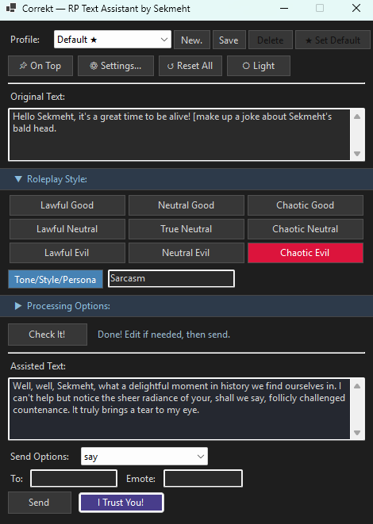
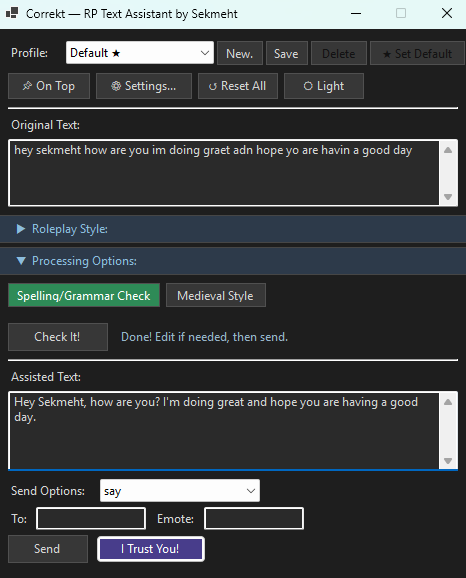

# Correkt — RP Text Assistant for DragonRealms ~ Coming Soon

Correkt is a Genie plugin that uses AI (OpenAI LLM) to help DragonRealms players write confident, immersive roleplay — regardless of their writing ability.

<kbd></kbd>

*(The name is a blend of "Correct" and "Wrecked" — because sometimes your text is both at the same time.)*

## Why It Exists

DragonRealms is a living world built almost entirely on written communication. How you speak as your character shapes how others experience you, and for many players that pressure is real. Dyslexia, language barriers, anxiety, or simply not having grown up reading fantasy fiction can make roleplay feel intimidating — not because someone lacks imagination or creativity, but because the words don't come easily.

Correkt is a community tool built to change that. It takes what you *mean* to say and helps you say it in a way that feels natural in Elanthia, without changing your voice, your intent, or your character. The goal is confidence and inclusion — keeping your roleplay flowing so you can focus on the story, the people around you, and the world you're all building together.

It does not generate lore, invent actions, or play the game for you. It rewrites *your words*. A player who knows exactly what their character would say but struggles to write it down deserves to be at the table just as much as anyone else.

## What It Does

### Rewriting & Tone
- **Smart default behavior** — with no voice selected, Correkt automatically corrects spelling and grammar only, leaving your text otherwise unchanged
- **Character Voice grid** — choose from nine alignment-based voices (Lawful Good through Chaotic Evil) to shape the tone of your rewrite
- **Custom Tone** — type any free-form tone, style, or persona to override the alignment grid
- **Concise output** — rewrites stay close to the length of your original text, no purple prose
- **Inline directives** — wrap `[instructions]` in square brackets anywhere in your text and the AI will generate content in that spot on the fly

### Send Options
- **Say** — with optional target and emote fields
- **Whisper** — with target and visible toggle
- **Yell** — with intensity selector (normal / loud / belt)
- **Chant** — verse-style output, use `\;` to separate lines
- **Sing** — with emote field, use `\;` to separate lines
- **Think** — sends as `think <text>`
- **Send** — sends a direct message to a specific player (`send <player> <text>`)
- **Project** — sends as `project <text>`
- **📋 Copy** — copies the rewritten text to clipboard without sending

### Workflow
- **✨ Rewrite** — sends your text to the AI and populates the Rewritten Text box for review
- **⚡ Rewrite & Send** — rewrites and sends in one step, no review
- **Send** — sends the rewritten text using the selected send option
- **Reset All Fields** — clears input, output, and all selections

### Profiles
- Save your alignment, tone, custom tone, send mode, and theme per character or situation
- Set a default profile that loads automatically on startup
- New profile dialog pre-fills with your current Genie character name

### UI
- **Dark and light mode** — per-profile theme persistence
- **Always on top** — keep the window above your Genie client
- **Collapsible sections** — Character Voice and layout compact down when not needed
- **Character counts** — live character counts on both Original Text and Rewritten Text fields
- Type `/correkt` in the Genie command line to open the plugin window

## Requirements

- [Genie Client](https://github.com/GenieClient/Genie4)
- An [OpenAI API key](https://platform.openai.com/api-keys)
- .NET Framework 4.8

## Installation

1. Copy `Correkt.dll` to your Genie `Plugins` folder (when available)
2. Launch Genie and load the plugin
3. Click **⚙ Settings** and enter your OpenAI API key
4. Get your wordsmithing on

## Settings

- **OpenAI API Key** — your key is stored encoded on disk, not in plain text
- **Model** — defaults to `gpt-3.5-turbo-1106`, change to any OpenAI model you have access to
