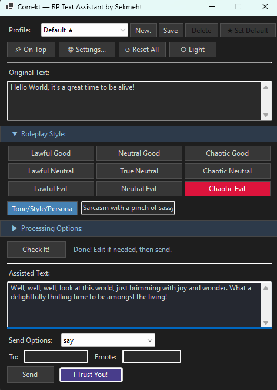

# Correkt — RP Text Assistant for DragonRealms

Correkt is a Genie plugin that uses AI to help DragonRealms players write confident, immersive roleplay — regardless of their writing ability.

*(The name is a blend of "Correct" and "Wrecked" — because sometimes your text is both at the same time.)*

## Why It Exists

DragonRealms is a living world built almost entirely on written communication. How you speak as your character shapes how others experience you, and for many players that pressure is real. Dyslexia, language barriers, anxiety, or simply not having grown up reading fantasy fiction can make roleplay feel intimidating — not because someone lacks imagination or creativity, but because the words don't come easily.

Correkt is a community tool built to change that. It takes what you *mean* to say and helps you say it in a way that feels natural in Elanthia, without changing your voice, your intent, or your character. The goal is confidence and inclusion — keeping your roleplay flowing so you can focus on the story, the people around you, and the world you're all building together.

It does not generate lore, invent actions, or play the game for you. It rewrites *your words*. A player who knows exactly what their character would say but struggles to write it down deserves to be at the table just as much as anyone else.

## What It Does

- **Rewrites your text** to be immersive and in-character for the setting
- **Corrects spelling and grammar** without rephrasing or changing your meaning
- **Supports multiple tones** — dramatic, humble, aggressive, playful, and more
- **Medieval or modern fantasy speech** — your choice
- **Chant and sing modes** that format output as verse lines for in-game use
- **Inline directives** — use `[square brackets]` in your text to let the AI fill in a gap on the fly
- **Profile system** — save your preferred settings per character or situation
- **Send directly to the game** — say, whisper, yell, chant, sing, or copy to clipboard

## Requirements

- [Genie Client](https://github.com/GenieClient/Genie4/tree/f41a5a89728719fef3b4a0896241c840aef80989)
- An [OpenAI API key](https://platform.openai.com/api-keys)
- .NET Framework 4.8

## Installation

1. Copy `Correkt.dll` to your Genie `Plugins` folder
2. Launch Genie and load the plugin
3. Click **⚙ Settings** and enter your OpenAI API key
4. Start playing
